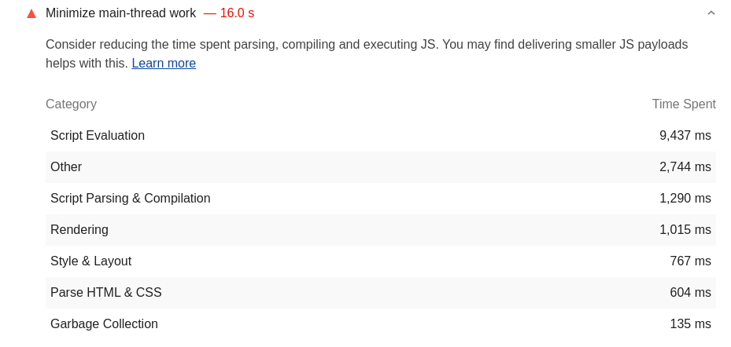

# Nectar (RFC)

Experimental server-side rendered implementation of ADS

Github: https://github.com/adsabs/Nectar

Use the sidebar to navigate around.

## Need

Since its creation in 2014, Bumblebee's current front-end tech stack has gotten more and more outdated making it difficult to develop, debug and maintain.
The current design could be improved to address issues related to accessibilty and user experience. SEO is also difficult, with search engines being unable to properly index pages, and non-js scrapers/users unable to access most features.
Finally, speed is a common complaint from users, improvements are needed to increase performance.

### Performance

Lighthouse report as of 5/18/2021: https://lighthouse-dot-webdotdevsite.appspot.com//lh/html?url=https%3A%2F%2Fui.adsabs.harvard.edu

_Minification is fixed now..._

This report was done on an emulated mobile device.

Performance is real issue on less-capable devices.

- Lots of unused code is downloaded, even with optimized bundles.
  - More modern tools like tree-shaking aren't used
- There is a lot of blocking code related just to evaluating the initial scripts
  

There is a lot of room for improvement when it comes to performance.

Regarding builds, that's one area Bumblebee is behind as well -- using Require.js for bundling requires explicit bundle creation configuration files. These are fragile and complex, and ultimately are only a band-aid solution. Not to mention that third-party libraries don't typically optimize their AMD builds resulting in huge mono-bundles that we have to load wholesale to use at all.

### Accessibility

Lots of work has been done to improve the accessibility on Bumblebee over time. There is a decent heading structure, decent contrast, and tabbing control. However there are more subtle issues that remain, like handling screen resizing to very large fonts for vision impaired users

### SEO

### UX

### DX
