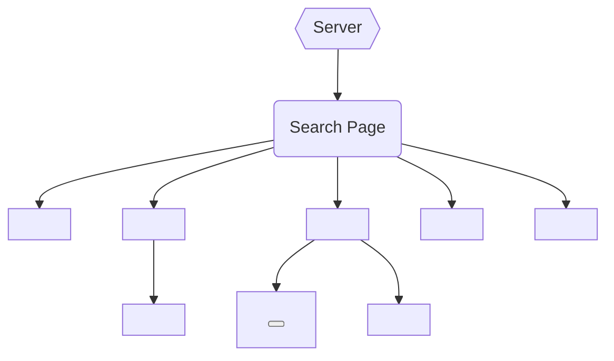
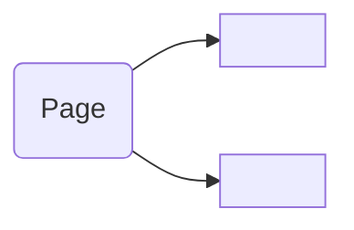

# Architecture

## Concept

### MVVM

Conceptually, the application utilizes a `model-view-viewmodel` (MVVM) pattern. With `React` acting as the View -> ViewModel and `xstate` acting as the model.

For example:


This idea is implemented through the use of functional (dumb) components and hooks which provide change detection based on model updates. As an example, we have a simple component:

```js
import { machine } from "./machine";

const SimpleComponent = () => {
  const [send, state] = useMachine(machine);
  return (
    <div>
      <div>{state.count}</div>
      <button onClick={() => send("increment")}>Increment</button>
    </div>
  );
};
```

Assuming our simple counting machine will increment the value when we click the button, you can see how the component works. When the state is updated, the hook will automatically trigger a re-render on the component updating the view.

In this example, the `model` is the machine, the `viewmodel` is our `SimpleComponent` implementation, and the `view` is handled by React.

Using this simple pattern, we can expand on this idea to compose larger more complex components which utilize their own machines to provide business logic, keeping the components themselves presentational.

### Structure

The application should be as distributed as possible. With components loosely coupled, only communicating via props/context. With this in mind, the structure of the application can stay simple with some basic rules.

1. Components are functional and idempotent
2. Components should strive to be presentational only
3. Communication only via props or context (indirect, asynchronous)

Since we are building a hybrid application, we start with the concept of pages.



Pages are the entry points for our application, they are rendered server-side (where applicable). In some cases, we will have just static pages rendered (ideal). If we need server-side data (session, api calls, etc.) we have use a hybrid approach and allow the page to hydrate on the client.

In the figure above, you can see how we use components which sit at a root-level where we have access to our data. This is how these components will be provided their state using props or possibly via a root machine (context).

## State Management

There is a tendency to assume we need to have a global data store in order properly manage our state. We can instead distribute state among the components that need it, only raising pieces of data upwards as necessary.

There are certain circumstances where a global state is needed, like user status (logged in/out) or api tokens. However, we can allow a small `<ToggleButton/>` component, for example, to hold its own private data store it can use and update.

Unlike `redux`, which assumes a global store with a single set of reducers, `xstate` provides its own pub/sub interface and context to each component which utilizes it.

We aren't building one single root state machine that would allow us to control all the other machines. In that scenario, we would be coupling the machines together at the root level, and it would make it more difficult to figure out how to manage communication. Instead we utilize React's built-in change detection to re-render on prop or context change.

Most of the time, we should be able to count on server-side data being available at the page level and passed to our components directly. If there needs to be something passed between components, we could make a page-level machine which would facilitate that state.

For example: Let's say we have a `<Search/>` component that asynchronously loads results using its own local machine. But we also have a `<Results/>` component, that needs those results loaded by search. This is the layout:



We would, in this case, move the search logic upwards into the `Page` machine. We would then pass a handler to `<Search/>` and a prop to `<Results/>`.

```js
<Search onSubmit={handleOnSubmit} />
<Results results={state.context.results}/>
```

We should strive to keep all state local, only moving it upwards as necessary.
