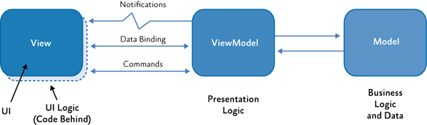

# Architecture

## Concept

### MVVM

Conceptually, the application utilizes a `model-view-viewmodel` (MVVM) pattern. With `React` acting as the View -> ViewModel and `xstate` acting as the model.

For example:



This idea is implemented through the use of functional (dumb) components and hooks which provide change detection based on model updates. As an example, we have a simple component:

```js
import { machine } from "./machine";

const SimpleComponent = () => {
  const [send, state] = useMachine(machine);
  return (
    <div>
      <div>{state.count}</div>
      <button onClick={() => send("increment")}>Increment</button>
    </div>
  );
};
```

Assuming our simple counting machine will increment the value when we click the button, you can see how the component works. When the state is updated, the hook will automatically trigger a re-render on the component updating the view.

In this example, the `model` is the machine, the `viewmodel` is our `SimpleComponent` implementation, and the `view` is handled by React.

Using this simple pattern, we can expand on this idea to compose larger more complex components which utilize their own machines to provide business logic, keeping the components themselves presentational.

### Structure

The application should be as distributed as possible. With components loosely coupled, only communicating via props/context. With this in mind, the structure of the application can stay simple with some basic rules.

1. Components are functional and idempotent
2. Components should strive to be presentational only
3. Communication only via props or context (indirect, asynchronous)

Since we are building a hybrid application, we start with the concept of pages.


Pages are the entry points for our application, they are rendered server-side (where applicable). In some cases, we will have just static pages rendered (ideal). If we need server-side data (session, api calls, etc.) we have use a hybrid approach and allow the page to hydrate on the client.

In the figure above, you can see how we use components which sit at a root-level where we have access to our data. This is how these components will be provided their state using props or possibly via a root machine (context).

## State Management

There is a tendency to assume we need to have a global data store in order properly manage our state. We can instead distribute state among the components that need it, only raising pieces of data upwards as necessary.

There are certain circumstances where a global state is needed, like user status (logged in/out) or api tokens. However, we can allow a small `<ToggleButton/>` component, for example, to hold its own private data store it can use and update.

Unlike `redux`, which assumes a global store with a single set of reducers, `xstate` provides its own pub/sub interface and context to each component which utilizes it.

We aren't building one single root state machine that would allow us to control all the other machines. In that scenario, we would be coupling the machines together at the root level, and it would make it more difficult to figure out how to manage communication. Instead we utilize React's built-in change detection to re-render on prop or context change.

Most of the time, we should be able to count on server-side data being available at the page level and passed to our components directly. If there needs to be something passed between components, we could make a page-level machine which would facilitate that state.

For example: Let's say we have a `<Search/>` component that asynchronously loads results using its own local machine. But we also have a `<Results/>` component, that needs those results loaded by search. This is the layout:


We would, in this case, move the search logic upwards into the `Page` machine. We would then pass a handler to `<Search/>` and a prop to `<Results/>`.

```js
<Search onSubmit={handleOnSubmit} />
<Results results={state.context.results}/>
```

We should strive to keep all state local, only moving it upwards as necessary.

### Page Transitions

In Bumblebee, page transitions are seamless since they happen completely on the client. This is not the case with the proposed system (using Next.js).

This is because Next.js splits the application into separate bundles for each page, attempting to minimize the amount downloaded per-route. This is, in some ways, better than the SPA approach since it allows us to isolate pages explicitly by stating our imports. Next.js is smart enough, however to make sure that pages with common imports recieve a common bundle that isn't re-downloaded when transitioning

## Server side

Next.js utilizes Express for its backend stack. We aren't stuck with this choice, however, Next.js has guides on how to use any number of different servers.
Express, for our purposes, should work fine.

The way that we see the "backend" part of the application is only a middleman between the client and the REST API that drives ADS currently. For example:


### Token management

Currently how tokens work in Bumblebee:

1. After initial load, client makes GET request to `/bootstrap` (after checking if it has user data locally and not expired)
2. The bootstrap call returns a set of user data, this looks like this:

```json
{
  "username": "username@email.com",
  "scopes": [
    "api",
    "user",
    "store-query",
    "execute-query",
    "store-preferences"
  ],
  "client_id": "AAA9eYcnw...",
  "access_token": "AAA1m2w...",
  "client_name": "BB client",
  "token_type": "Bearer",
  "ratelimit": 1.0,
  "anonymous": false,
  "client_secret": "AAAH4n...",
  "expire_in": "2500-01-01T00:00:00",
  "refresh_token": "mkNyH8b..."
}
```

It is also possible for the user to be `anonymous`. In this case, the token has a shorter expiration.

3. After this is recieved, the client will make all API calls using this token.

Since Bumblebee is a SPA, this bumblebee call should, in theory only be called once -- since the page never refreshes during a normal session.

In the proposed system, we have a hybrid approach. But ultimately it is the same thing, only done serverside and using a local session. Basically:

1. Server receives request for a particular route
2. Before rendering, it will call `getServersideProps` or whatever server-side function that is exported by the page assigned to that route.
3. As part of this call, it will use the `node.js API wrapper` to call `/bootstrap` and receive this user data
4. This data will be placed into the current session, which is used server-side and passed to the page (as props)

The downside to this approach is that we have to provide this logic of checking for the session data, expiration, etc. each time a page, that has serverside requirements, is loaded.

We should be able to cut down on the repetitive code by utilizing HOCs and possibly the number of calls by storing the user data in local storage.

For example:

```js
// withSessionData.ts
export const withSessionData = (cb) => {
  // get session data, update context and types
  cb(augmentedContext);
};

// landingPage.tsx
export const getServersideProps = withSessionData((context) => {
  return { props: { data } };
});
```
